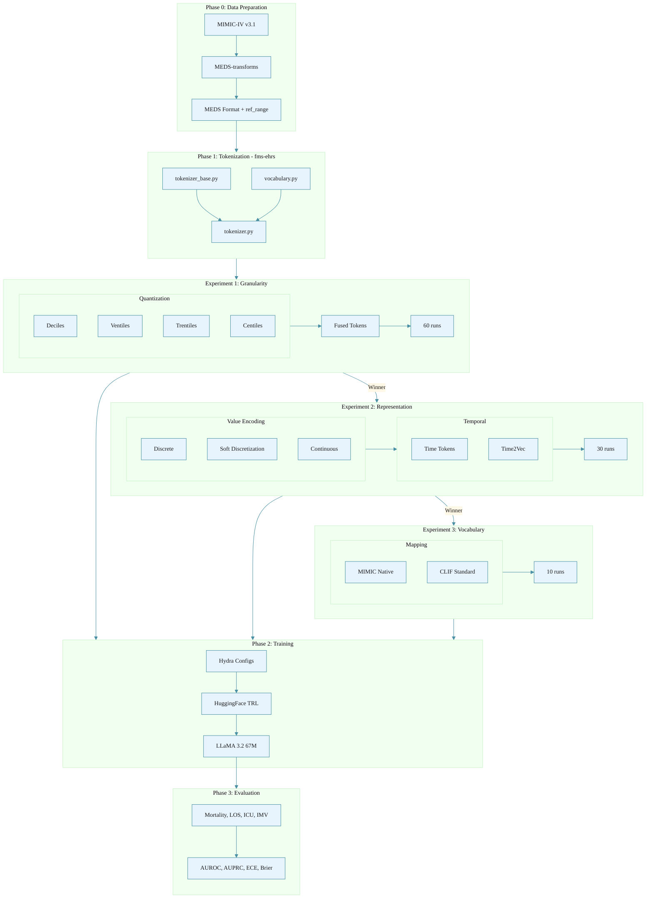

# Evaluating Input Representation Methods for EHR Foundation Models

## 1. Introduction

Electronic Health Records (EHRs) consist of heterogeneous data streams, combining discrete diagnostic codes with continuous physiological signals. Translating this multi-modal input into sequences compatible with transformer architectures poses a fundamental representation challenge. Current state-of-the-art frameworks, such as the Enhanced Transformer for Health Outcome Simulation (ETHOS) and its Adaptive Risk Estimation System (ARES) [1], employ decile binning to discretize continuous laboratory values into categorical tokens. While this approach enables the application of standard language modeling techniques to clinical data, the optimal encoding of continuous values for preserving clinical semantics remains an open research question.

This study proposes a systematic evaluation framework for input representation methods in EHR foundation models. We investigate how three distinct layers of input representation—quantization granularity, representation mechanism (discrete vs. continuous embedding), and vocabulary structure—affect model generalization and clinical reasoning. Our objective is to provide empirical guidelines for constructing robust, generalizable EHR embeddings across standard clinical prediction tasks.

**Scope Statement**: This document constitutes a research proposal establishing an experimental framework. Comprehensive empirical results are forthcoming upon completion of computational experiments. Certain methodological constraints—particularly the use of population-level reference ranges without demographic stratification—represent inherent limitations of the MIMIC-IV v3.1 dataset that we explicitly acknowledge.

## 2. Related Work

This section situates our evaluation study within the broader landscape of EHR foundation models, continuous value representation, vocabulary standardization, and clinical evaluation frameworks. We organize the review around the three experimental axes of our study: quantization granularity (§2.1–2.2), representation mechanics (§2.3), and vocabulary semantics (§2.4), followed by evaluation considerations (§2.5).

### 2.1. EHR Foundation Models and Tokenization Pipelines

The application of transformer architectures to longitudinal EHR data has yielded substantial advances in clinical prediction. BEHRT [2] pioneered BERT-style pretraining on diagnosis code sequences, demonstrating that self-supervised objectives transfer effectively to downstream clinical tasks. Med-BERT [3] extended this approach to structured EHR data including diagnoses, procedures, and medications, establishing that domain-specific pretraining outperforms general-purpose language models on clinical benchmarks. CORE-BEHRT [4] subsequently introduced rigorous optimization and evaluation protocols, addressing reproducibility concerns in the EHR foundation model literature.

The ETHOS-ARES framework [1] represents the current state-of-the-art for adaptive clinical risk estimation. ETHOS tokenizes Patient Health Timelines (PHTs) from EHRs—encompassing laboratory results, diagnoses, procedures, medications, and temporal markers—into discrete sequences amenable to autoregressive transformer modeling. The system employs a 14-stage preprocessing pipeline that transforms raw MIMIC-IV data into the Medical Event Data Standard (MEDS) format, applies code filtering and frequency-based vocabulary construction, and discretizes continuous laboratory values via decile quantization. ARES subsequently leverages pretrained ETHOS representations to compute dynamic, personalized risk probabilities for clinician-defined critical events. Evaluated on MIMIC-IV v2.2 with its Emergency Department extension, ETHOS-ARES achieved superior discrimination (AUROC) over classical early warning systems (NEWS, MEWS) and contemporary machine learning baselines for predicting hospital admission, ICU admission, and prolonged length of stay.

Our study extends the ETHOS-ARES codebase to systematically evaluate alternative input representations while preserving the established preprocessing pipeline. This design enables controlled comparison of representation choices without confounding from pipeline-level differences.

### 2.2. Discretization of Continuous Clinical Variables

The discretization of continuous laboratory values into categorical bins is ubiquitous in EHR foundation models but remains understudied. ETHOS-ARES employs population-based decile quantization, partitioning the empirical distribution of each laboratory analyte into ten equally-populated bins. This approach ensures uniform token frequency across bins but discards clinical semantics: a glucose value of 69 mg/dL (hypoglycemic) and 71 mg/dL (normal) may occupy adjacent bins with no representation of their distinct clinical significance.

Clinical laboratory medicine has long recognized that reference intervals—the range of values observed in a healthy reference population—provide essential context for interpreting test results [5]. Reference intervals are typically reported as the central 95% of the healthy population distribution (2.5th to 97.5th percentiles) and vary by age, sex, and physiological state. The MIMIC-IV database provides reference range annotations (`ref_range_lower`, `ref_range_upper`) for a substantial fraction of laboratory events, enabling clinically-anchored discretization strategies that we propose to evaluate.

Prior work on discretization in clinical machine learning has primarily focused on traditional models rather than foundation model pretraining. Studies comparing equal-width, equal-frequency, and entropy-based discretization for clinical prediction have yielded mixed conclusions regarding optimal granularity [6]. Our study addresses this gap by systematically evaluating discretization strategies within the foundation model paradigm, where representation learning during pretraining may differentially benefit from various binning schemes.

### 2.3. Continuous Value Representation in Transformers

The fundamental tension between discrete tokenization and continuous value representation has received increasing attention in the scientific machine learning literature. Standard transformer architectures operate on discrete token vocabularies, necessitating discretization of continuous inputs—a process that inherently discards information. Several approaches have been proposed to mitigate this limitation.

xVal [7] introduces a continuous number encoding scheme for scientific language models that represents numeric values as single tokens with learned magnitude embeddings. Rather than discretizing values into bins, xVal encodes the mantissa and exponent of floating-point numbers through separate embedding pathways, preserving full numeric precision. Evaluation on scientific datasets demonstrates strong out-of-distribution generalization, suggesting that continuous encodings may better capture numeric semantics than discrete alternatives. This approach directly informs our Experiment 2 on representation mechanics, where we compare discrete binning against MLP-based continuous encoders inspired by the xVal paradigm.

Norouzi et al. [14] introduced the Convex Combination of Semantic Embeddings (ConSE) framework for zero-shot image classification. Their key insight is that an input can be represented as a weighted combination of learned category embeddings, where the weights derive from a probabilistic classifier's output distribution. Formally, given classifier probabilities \(p_1, \ldots, p_n\) over \(n\) categories with corresponding embeddings \(E_1, \ldots, E_n\), the input embedding is computed as \(\sum_i p_i \cdot E_i\). This convex combination preserves the geometric structure of the embedding space while enabling smooth interpolation between discrete categories. ConSE demonstrated that this simple approach outperforms more complex joint training methods on ImageNet zero-shot learning, precisely because the convex combination leverages rather than distorts the semantic relationships encoded in the embedding space.

We adapt the ConSE principle to continuous laboratory value representation. Rather than using classifier probabilities over all categories, we apply a local variant: for a value \(v\) falling between bin boundaries \(b_i\) and \(b_{i+1}\), the interpolation weight \(\alpha = (v - b_i)/(b_{i+1} - b_i)\) defines a two-component convex combination with weights \((1-\alpha, \alpha)\). This local support constraint—using only adjacent bins—ensures monotonicity in the embedding space (values closer to \(b_i\) receive embeddings closer to \(E[b_i]\)) and interpretability (the interpolation weight directly corresponds to relative position). This adaptation maintains the core ConSE insight—that convex combinations preserve embedding space structure—while tailoring it to the ordered, continuous nature of laboratory values.

### 2.4. Vocabulary Standardization and Cross-Site Generalization

EHR foundation models trained on institution-specific code vocabularies face substantial generalization challenges when deployed to new sites. Laboratory test identifiers, diagnosis codes, and medication formulations vary across institutions, limiting the transferability of learned representations.

MedRep [8] addresses this challenge by proposing integrated medical concept representations aligned with the Observational Medical Outcomes Partnership (OMOP) Common Data Model. By mapping institution-specific codes to standardized concepts, MedRep enables foundation models to generalize across sites with different source vocabularies. The framework demonstrates improved performance on unseen medical codes and enhanced model integration across heterogeneous EHR systems.

Burkhart et al. [9] provide empirical evidence on the transferability of EHR foundation models, evaluating ETHOS representations trained on MIMIC-IV when applied to an independent institutional dataset. Their analysis of representation dynamics and classifier performance across sites informs our understanding of how vocabulary choices affect generalization. We adopt their clinical outcome definitions—in-hospital mortality, prolonged length of stay, ICU admission, and invasive mechanical ventilation—as prediction targets for our evaluation study.

The Clinical Longitudinal Information Framework (CLIF) represents an emerging standard for harmonizing critical care data across institutions. Our Experiment 3 evaluates the trade-off between raw MIMIC-IV source codes and CLIF-standardized concepts, quantifying how vocabulary aggregation affects representation quality within a single-site evaluation setting.

### 2.5. Evaluation Frameworks for Clinical Foundation Models

Rigorous evaluation of EHR foundation models requires metrics beyond discrimination (AUROC). FoMoH [10] establishes a comprehensive evaluation framework emphasizing clinically meaningful tasks, calibration assessment, and subpopulation fairness analysis. The framework argues that foundation model evaluation should span patient outcome prediction, early detection of acute conditions, and chronic disease progression, with explicit attention to model reliability across demographic subgroups.

EHRSHOT [11] provides a complementary benchmark focused on few-shot evaluation, assessing how efficiently foundation models adapt to new prediction tasks with limited labeled data. The benchmark includes 15 clinical prediction tasks with standardized train/validation/test splits, enabling systematic comparison across models.

We adopt evaluation protocols from both frameworks: FoMoH-style calibration and fairness metrics alongside EHRSHOT-aligned task definitions. This hybrid approach ensures that our evaluation captures both the discrimination and reliability dimensions of representation quality.

## 3. Experimental Design

This study evaluates the impact of input representations on clinical prediction performance. Following Burkhart et al. [9], we adopt four prediction tasks: in-hospital mortality, long length of stay (≥7 days), ICU admission after 24 hours, and invasive mechanical ventilation (IMV) event after 24 hours. These outcomes span acute deterioration and resource utilization, providing complementary perspectives on representation quality.

### 3.1. Experiment 1: Granularity and Semantic Anchoring

**Objective**: Determine the optimal binning granularity for clinical prediction and evaluate whether clinically-anchored bins—informed by laboratory reference ranges—improve upon population-based quantiles.

**Conditions** (6 granularity configurations):
- **Decile**: 10-bin population-based quantization (ETHOS-ARES baseline)
- **Ventile**: 20-bin population-based quantization
- **Clinically Anchored Ventile**: Three-region partitioning with 5-10-5 bin allocation:
  - Below Normal (x < L): 5 bins spanning values below the reference range lower bound
  - Within Normal (L ≤ x ≤ U): 10 bins providing higher resolution for physiologically normal variations
  - Above Normal (x > U): 5 bins spanning values above the reference range upper bound
- **Trentile**: 30-bin population-based quantization
- **Clinically Anchored Trentile**: Three-region partitioning with 10-10-10 bin allocation
- **Centile**: 100-bin population-based quantization

**Cross-Cutting Option** (applied to all 6 granularity conditions):
- **Fused Tokens** (yes | no): Laboratory code and quantized value combined into a single vocabulary token (e.g., `LAB//50931//Q7` instead of separate `LAB//50931` and `Q7` tokens). This representation reduces sequence length by approximately 30–40% for laboratory-dense patient timelines while preserving the discrete tokenization paradigm.

**Total Experiment 1 Configurations**: 6 granularity × 2 fused options = **12 configurations** × 5 seeds = **60 training runs**

**Clinical Anchoring Implementation**:

Reference ranges (L, U) are extracted from the MIMIC-IV `labevents` table fields `ref_range_lower` and `ref_range_upper`. Within each region (below, within, above normal), values are partitioned into equal-frequency bins computed from the training set distribution.

**Acknowledged Limitation**: MIMIC-IV v3.1 provides population-level reference ranges without stratification by age, sex, or other demographic factors. Demographically-adjusted reference intervals—while clinically preferred—require external data sources that are not uniformly available across all laboratory analytes. We treat population-level anchoring as a first-order approximation, with demographic stratification identified as future work.

**Methodological Details**:
- **Unit Harmonization**: All laboratory values are converted to canonical units prior to binning; the unit conversion mapping is documented and released with our code.
- **Extreme Value Handling**: Values beyond the 0.5th and 99.5th training set percentiles are clipped to mitigate outlier-driven bin boundary distortion.
- **Missing Reference Ranges**: Laboratory codes lacking reference range annotations (approximately 19.7% of events) default to standard population-based quantile binning.

### 3.2. Experiment 2: Representation Mechanics

**Objective**: Compare discrete tokenization against continuous and hybrid representation methods, evaluating the hypothesis that preserving numeric precision improves clinical prediction.

**Conditions** (3 value representation methods × 2 temporal encoding strategies):

**Value Representation Methods**:
- **Optimally-binned Discrete Tokens**: Standard categorical embedding of binned values, where each bin receives a unique vocabulary token. This serves as the baseline representation mechanism using the optimal binning strategy identified in Experiment 1.

- **Convex Combinations (Soft Discretization)**: Adapting the ConSE framework [14] to continuous value representation, we represent values as weighted interpolations of adjacent bin embeddings:
  - For value v falling between bin boundaries b_i and b_{i+1}, compute interpolation weight α = (v − b_i) / (b_{i+1} − b_i)
  - Final embedding = (1 − α) · E[b_i] + α · E[b_{i+1}]
  - Unlike the original ConSE formulation which combines all category embeddings weighted by classifier probabilities, we employ a local support constraint using only adjacent bins. This ensures: (i) monotonicity—values closer to b_i receive embeddings closer to E[b_i]; (ii) interpretability—the weight α directly corresponds to relative position within the bin interval; and (iii) computational efficiency—only two embeddings are accessed per value
  - The loss function remains standard cross-entropy for causal language modeling; no auxiliary regularization is applied

- **Learned Continuous Encoders**: Direct projection of continuous values via multi-layer perceptrons, following the xVal paradigm [7]:
  - Input: z-score normalized value (per laboratory code, computed from training set statistics)
  - Architecture: 2-layer MLP with GELU activation projecting to the model's embedding dimension
  - Test-time values are clipped to ±5σ to bound distributional shift from training

**What numeric values the model consumes (critical implementation detail)**:

For both **soft discretization** and **continuous encoders**, the model consumes the **raw per-event numeric measurement** from MEDS/CLIF tables (the `numeric_value` column) aligned to token positions:

- For each numeric event, tokenization emits a `(code_token, quantile_token)` pair (unfused setting used in Experiment 2).
- We add a parallel per-token array `numeric_values` with the same length as the token sequence:
  - `numeric_values[i] = null` for non-numeric tokens (code tokens, time-spacing tokens, demographics/prefix tokens, discharge suffix tokens, etc.)
  - `numeric_values[i] = raw_measurement` for the **quantile token position** corresponding to the event
- This alignment is preserved through time-spacing token insertion, 24h truncation, and fixed-length padding/truncation (`padded_numeric_values`, `padded_times`).

**Storetime semantics**: For MIMIC-IV MEDS extraction, `numeric_value` reflects the measurement as available in the EHR under `storetime` ordering (see `benchmarks/mimic-meds-extraction/configs/event_configs_v3.1_full.yaml`). For tables without storetime, we use their native timestamps as described in §5.6.

**Edge cases / non-numeric events**:

- Events without a meaningful scalar (medication administrations, transfers, ICU admission/discharge, diagnoses) have `numeric_values = null`.
- Numeric events with missing values remain `null` and are masked out (they do not invoke soft/continuous encoders).

**Temporal Encoding Strategies**:

We encode **relative time differences** (hours since admission or time between events) rather than shifted absolute timestamps. This decision is grounded in MIMIC-IV's deidentification policy: "A single date shift was assigned to each subject_id. As a result, the data for a single patient are internally consistent... Conversely, distinct patients are not temporally comparable" [13]. Encoding relative time preserves clinically meaningful temporal patterns while avoiding spurious cross-patient correlations from arbitrary date shifts.

- **Time Spacing Tokens**: Discrete temporal interval tokens following the ETHOS-ARES protocol, injected between events to encode time elapsed. The tokenizer computes `Δt = event_time[i+1] - event_time[i]` and maps to categorical bins (e.g., `T_5m-15m`, `T_1h-2h`, `T_1d-2d`).

- **Time2Vec with RoPE**: Learned continuous temporal encoding via Time2Vec [15], which represents relative time `τ` (hours since admission) as:
  $$t2v(\tau) = [w_0 \cdot \tau + \phi_0, \sin(w_1 \cdot \tau + \phi_1), \ldots, \sin(w_k \cdot \tau + \phi_k)]$$
  where `τ = (event_time - admission_time).total_hours()`. This encoding is added to token embeddings prior to the transformer layers, while RoPE handles sequence position encoding natively.

**Implementation**: The `fms_ehrs/framework/dataset.py` module computes `relative_times` from `padded_times` at data loading time:
1. For each hospitalization, identify the admission time as the first non-null timestamp in the sequence
2. Compute `τ_i = (t_i - t_admission).total_seconds() / 3600` hours for each token position
3. Padding positions (where `padded_times[i]` is null) receive `τ = 0`

This approach ensures that Time2Vec encodings are computed identically during training and inference, and that the relative time computation respects MIMIC-IV's deidentification constraints.

**xVal-RoPE Compatibility Note**: The xVal-style continuous encoder and RoPE operate on orthogonal embedding dimensions—xVal modifies the **value embedding** via z-score normalization + MLP projection, while RoPE rotates **query/key vectors** based on position indices. These mechanisms compose without interference.

**Total Experiment 2 Configurations**: 3 methods × 2 temporal = **6 configurations** × 5 seeds = **30 training runs**

### 3.3. Experiment 3: Data Format and Vocabulary Semantics

**Objective**: Evaluate the trade-off between vocabulary granularity and semantic regularization by comparing institution-specific codes against standardized clinical concepts, while ensuring data parity between the two data processing pipelines.

**Conditions**:
- **MEDS Format (Native MIMIC)**: Models trained on MEDS-formatted data where the `code` column contains raw source identifiers (e.g., `LAB//50931`). This condition preserves maximum available granularity but yields institution-specific representations. Data extraction uses the adapted ETHOS-ARES pipeline.

- **CLIF Format (Standardized)**: Models trained on CLIF-formatted data where the `code` column contains standardized clinical concepts (e.g., `LAB//glucose_serum`). This condition applies semantic aggregation via the CLIF-MIMIC converter implemented in `fms-ehrs`. The CLIF format is described in Burkhart et al. [9] and the converter is available in `fms-ehrs/fms_ehrs/config/clif-21.yaml`.

**Cohort Alignment for Data Parity**: A critical methodological consideration is ensuring that both pipelines operate on identical patient cohorts. CLIF's natural scope is ICU patients, whereas MEDS can include all hospitalizations. To enable fair comparison:

1. **Experiment 3 Cohort**: ICU patients with hospital stays ≥24 hours
   - Extracted using `scripts/align_cohorts.py` which identifies the intersection of patients with:
     - At least one ICU stay (`icu/icustays`)
     - Hospital stay duration ≥24 hours
   - The same patient IDs are applied to both MEDS and CLIF extraction pipelines
   - This ensures identical event counts (up to format-specific mapping differences)

2. **Experiments 1 & 2 Cohort**: All hospitalizations with stay ≥24 hours
   - Broader cohort including non-ICU patients
   - Uses the full MEDS extraction without ICU restriction

This cohort design ensures Experiment 3 isolates the effect of vocabulary mapping from cohort composition differences.

**Total Experiment 3 Configurations**: 2 data formats × 5 seeds = **10 training runs**

**Vocabulary Mapping Analysis**: We quantify and report:
- One-to-many mappings: source codes collapsing to single CLIF concepts
- Many-to-one mappings: single source codes expanding to multiple CLIF concepts
- Unmapped codes: source codes without CLIF mappings and their frequency

**Cross-Site Generalization Limitation**: Due to data access constraints, this proposal focuses on within-MIMIC evaluation. External validation on additional CLIF/OMOP-compliant datasets (e.g., eICU, institutional EHRs) is essential to substantiate generalization claims and is identified as a priority for follow-up work.

### 3.4. Total Training Runs Summary

| Experiment | Description | Cohort | Configs | × Seeds | Total Runs |
|------------|-------------|--------|---------|---------|------------|
| **Exp 1** | Granularity & Semantic Anchoring | All hosp ≥24h | 12 | × 5 | **60** |
| **Exp 2** | Representation Mechanics | All hosp ≥24h | 6 | × 5 | **30** |
| **Exp 3** | Data Format / Vocabulary | ICU ≥24h | 2 | × 5 | **10** |
| **Total** | | | 20 | | **100** |

**Cohort Specification**:
- **All hosp ≥24h**: All hospitalizations with length of stay ≥24 hours (Experiments 1 & 2)
- **ICU ≥24h**: ICU patients with hospital stay ≥24 hours, extracted via `scripts/align_cohorts.py` to ensure data parity between MEDS and CLIF pipelines (Experiment 3)

## 4. System Architecture

### 4.1. Pipeline Overview



### 4.2. Repository Structure

**fms-ehrs** (Tokenization and Training Framework):
```
fms-ehrs/
├── fms_ehrs/
│   ├── framework/
│   │   ├── tokenizer_base.py      # Quantization strategies, padding, 24h truncation
│   │   ├── tokenizer.py           # YAML-driven tokenizer with numeric_values support
│   │   ├── vocabulary.py          # Token vocabulary management
│   │   ├── dataset.py             # Dataset loader with numeric_values/relative_times
│   │   ├── model_wrapper.py       # Wrapper for soft/continuous encoders + Time2Vec
│   │   ├── soft_discretization.py # ConSE-inspired convex combinations (Exp 2)
│   │   ├── continuous_encoder.py  # xVal-inspired MLP encoder (Exp 2)
│   │   └── time2vec.py            # Learned temporal embeddings (Exp 2)
│   ├── config/
│   │   ├── mimic-meds-ed.yaml     # MEDS tokenization config (with PROC timing fix)
│   │   └── clif-21.yaml           # CLIF tokenization config (Exp 3)
│   └── scripts/
│       ├── tokenize_w_config.py   # Tokenization entry point
│       ├── tune_model.py          # Pretraining script (Exp 1)
│       ├── train_representation.py # Representation training (Exp 2)
│       ├── extract_outcomes.py    # CLIF outcome extraction
│       └── fine_tune_classification.py  # Outcome classifier fine-tuning
└── slurm/
    └── 41_tokenize_meds_ed.sh     # SLURM job template
```

**input-representation-benchmark** (Experiment Orchestration):
```
input-representation-benchmark/
├── methods/
│   ├── proposal.md                # This document
│   └── paper.md                   # Full manuscript
├── benchmarks/
│   └── mimic-meds-extraction/     # MEDS data pipeline
│       ├── meds_pipeline/         # Adapted from ETHOS-ARES (MIT License)
│       │   ├── pre_MEDS.py        # Pre-MEDS wrangling (credited)
│       │   └── configs/           # Extraction configs
│       ├── configs/
│       │   └── event_configs_v3.1_full.yaml  # Custom event config (storetime)
│       ├── scripts/
│       │   └── 01_extract_meds_full.sh      # Extraction entry point
│       └── data/meds/             # MEDS-formatted data (validated: 20,882 vocab)
├── configs/
│   └── experiment.yaml            # Hydra config with SLURM launcher
├── run_experiments.py             # Python launcher for job generation
├── scripts/                       # MEDS-specific utility scripts
│   ├── extract_outcomes_meds.py   # 4-outcome extraction from MEDS data
│   ├── normalize_meds_tokenized_layout.py  # Layout normalization for fms-ehrs
│   ├── align_cohorts.py           # ICU cohort extraction for Exp3 data parity
│   ├── validate_cohort_parity.py  # Verify MEDS/CLIF data equivalence
│   ├── smoke_test_exp2.py         # Exp2 configuration verification
│   └── minimal_e2e_dryrun.py      # End-to-end pipeline test
├── slurm/                         # SLURM job orchestration
│   ├── preamble.sh                # Environment setup
│   └── run_from_jobfile.sh        # Array job runner
└── tests/                         # Unit tests
```

**Hydra Design: Single Config + Job File Generation**

1. **One `experiment.yaml`** with all parameters and SLURM launcher settings
2. **`run_experiments.py`** generates job files with valid parameter combinations
3. **SLURM array jobs** execute each configuration in parallel

This approach handles constrained parameter combinations (e.g., `5-10-5` only valid for `ventiles`) that Hydra's basic sweeper cannot express.

## 5. Methodology: The Input Representation Framework

### 5.1. Codebase Architecture

This project establishes a reproducible evaluation environment using two independent codebases with a clear separation of concerns:

**Phase 0 — Data Extraction**: We use the MEDS extraction pipeline adapted from **ETHOS-ARES** [1] for the MIMIC-IV → pre-MEDS → MEDS conversion. The original pipeline is available at https://github.com/ipolharvard/ethos-ares under the MIT License (Copyright © 2024 Paweł Renc). We have adapted this pipeline to our `input-representation-benchmark/benchmarks/mimic-meds-extraction/meds_pipeline/` directory with:
- Modified split fractions (70/10/20 vs. original 90/10)
- Custom event configuration (`event_configs_v3.1_full.yaml`) using `storetime` semantics
- Extended MEDS fields (`ref_range_lower`, `ref_range_upper`) for clinical anchoring

**Attribution**: All pre-MEDS wrangling code (`pre_MEDS.py`) and MEDS extraction configurations are derived from the ETHOS-ARES codebase. We acknowledge and thank the original authors for making their pipeline publicly available. No further dependency on the ETHOS-ARES codebase exists beyond this extraction step; all tokenization, training, and evaluation are performed in our independent `fms-ehrs` framework.

**Phases 1–3 — Tokenization, Training, and Evaluation**: All downstream processing relies entirely on our `fms-ehrs` codebase, which provides:

1. **Tokenization Framework** (`fms_ehrs/framework/`):
   - `tokenizer_base.py`: Core quantization strategies (deciles, ventiles, trentiles, centiles; clinical anchoring)
   - `tokenizer.py`: YAML-configurable tokenizer with flexible options
   - `vocabulary.py`: Token vocabulary management with auxiliary data storage
   - `soft_discretization.py`: Convex combination embeddings (Experiment 2)
   - `continuous_encoder.py`: MLP-based continuous value encoding (Experiment 2)
   - `time2vec.py`: Learned temporal embeddings (Experiment 2)

2. **Model Training** (`fms_ehrs/scripts/`):
   - HuggingFace Transformers + TRL SFTTrainer integration
   - Optuna hyperparameter optimization
   - Weights & Biases logging

3. **Evaluation Pipeline**:
   - Representation-based metrics (AUROC, AUPRC, Brier Score, ECE)
   - Subgroup fairness analysis
   - Efficiency benchmarks (FLOPs, latency, token counts)

**Tokenization Validation**:
Validated the tokenization pipeline on MEDS-formatted MIMIC data:
- **Vocabulary size**: 20,882 tokens
- **Average timeline length**: 1,450 tokens per patient
- **Runtime**: ~1h10min on <150GB memory
- **Configuration**: `fms_ehrs/config/mimic-meds-ed.yaml` with decile quantization and time spacing tokens

This represents the first non-CLIF configuration file for `fms-ehrs`, demonstrating successful adaptation to MEDS-formatted data from the ETHOS extraction pipeline.

**Design Principle**: The complete independence from `ethos-ares` for tokenization and training enables us to implement novel representation methods (soft discretization, continuous encoders, Time2Vec) without modifying upstream code, while maintaining compatibility with the established MEDS data format.

### 5.2. Clinically-Anchored Quantization

#### Formal Definition

Given a set of observed values $X = \{x_1, ..., x_n\}$ for a specific lab code, and a reference range $[L, U]$:

We partition the value space into $N$ disjoint intervals (bins) $B_1, ..., B_N$. The allocation of bins is determined by the clinical regions:

1. **Below Normal** ($x < L$): allocated $N_{below}$ bins
2. **Within Normal** ($L \le x \le U$): allocated $N_{within}$ bins
3. **Above Normal** ($x > U$): allocated $N_{above}$ bins

The breakpoints within each region are determined by local quantiles of the data distribution within that region.

#### Algorithm

Let $X_{below} = \{x \in X | x < L\}$, $X_{within} = \{x \in X | L \le x \le U\}$, $X_{above} = \{x \in X | x > U\}$

The set of breakpoints $Q$ is:

$$Q = Q_{below} \cup \{L\} \cup Q_{within} \cup \{U\} \cup Q_{above}$$

Where for 5-10-5 allocation (ventiles):
- $Q_{below} = \{q_k(X_{below}) \mid k \in \{0.2, 0.4, 0.6, 0.8\}\}$ (4 breaks → 5 bins)
- $Q_{within} = \{q_k(X_{within}) \mid k \in \{0.1, 0.2, ..., 0.9\}\}$ (9 breaks → 10 bins)
- $Q_{above} = \{q_k(X_{above}) \mid k \in \{0.2, 0.4, 0.6, 0.8\}\}$ (4 breaks → 5 bins)

This yields 19 breakpoints defining 20 bins.

#### Implementation Strategies

**Strategy A: Paired Reference Ranges** (both L and U exist)
- **Allocation**: 5-10-5 (ventiles) or 10-10-10 (trentiles)
- **Clinical Rationale**: Higher granularity within the normal range where most data lies

**Strategy B: Data-Driven Baseline** (no reference range)
- **Allocation**: N equiprobable bins over the entire distribution
- **Method**: Standard quantile binning

*Critical Finding*: Analysis of 142M events confirmed that reference ranges in MIMIC-IV are always paired (or both missing), eliminating the need for handling partial ranges.

### 5.3. Preliminary Feasibility Analysis on MIMIC-IV v3.1

#### Reference Range Coverage

**Dataset**: 1,128 unique lab codes, 142,131,243 lab events, 364,627 patients

**By Lab Code**:
- Both bounds: 392 codes (34.8%)
- No bounds: 736 codes (65.2%)
- Lower only: 0 codes (0%)
- Upper only: 0 codes (0%)

**By Lab Event**:
- Both bounds: 114,135,372 events (80.3%)
- No bounds: 27,995,871 events (19.7%)
- Lower/upper only: 0 events (0%)

**Critical Finding**: Reference ranges are **always paired** in MIMIC-IV v3.1 (verified across 100% of events).

#### Ventile Quantization Results

**Total codes quantized**: 200 lab codes (top 200 by frequency, covering 97.06% of all lab events)

**Bin distribution**:
- 20 bins: 161 codes (80.5%) — achieved target
- 16 bins: 37 codes (18.5%) — insufficient data in one region
- <16 bins: 2 codes (1.0%)

**Improvement over standard**: Ventile achieves 80.5% codes with 20 bins vs 64% with purely data-driven approach (+16.5% improvement)

#### Clinical Validation Example: Glucose

**Lab**: Glucose (itemid 50931)
**Reference Range**: [70.0, 105.0] mg/dL
**Total bins**: 20

**Binning structure** (verified):
```
Below ref (<70):     [54, 61, 65, 67]                =  5 bins
Within ref [70-105]: [70, 79, 84, 87, 90, 92,        = 10 bins
                      95, 97, 100, 103, 105]
Above ref (>105):    [115, 127, 146, 184]            =  5 bins
                                             Total = 20 bins
```

Reference bounds (70, 105) are present as breakpoints, creating clinically meaningful categories for below-normal, normal, and above-normal glucose values.

### 5.4. Hierarchical Binning for Efficient Granularity Optimization

A naive approach to Experiment 1 would require independent preprocessing runs for each granularity condition (10, 20, 30, 50, 100 bins), redundantly computing bin boundaries from the same training distribution. We adopt a hierarchical binning strategy that computes boundaries once at maximum resolution and derives coarser granularities through deterministic aggregation.

**Preprocessing Optimization**:
1. Compute percentile breakpoints (100 bins) for each laboratory code from the training set distribution, yielding boundaries at the 1st, 2nd, ..., 99th percentiles.
2. Derive coarser bin boundaries by subsetting:
   - **Decile (10 bins)**: Retain boundaries at percentiles {10, 20, 30, 40, 50, 60, 70, 80, 90}
   - **Ventile (20 bins)**: Retain boundaries at percentiles {5, 10, 15, ..., 95}
   - **Trentile (30 bins)**: Retain boundaries at percentiles {3.33, 6.67, 10, ..., 96.67} (approximated to nearest integer percentiles)
3. For clinically-anchored variants, this hierarchy is applied within each region (below, within, above normal) independently.

This approach reduces preprocessing time by a factor equal to the number of granularity conditions while ensuring exact correspondence between hierarchical and independently-computed boundaries.

**Limitation—Model Training Remains Per-Condition**: While preprocessing is accelerated, each granularity condition requires separate model pretraining because vocabulary tokens and their learned embeddings differ across bin counts.

### 5.5. Model Configuration

We employ a scaled-down LLaMA 3.2 architecture (~67.3M parameters) throughout all experiments. This configuration balances model capacity for representation learning with computational tractability across 100 total training runs.

**Model Initialization**:

```python
config = AutoConfig.from_pretrained(
    "meta-llama/Llama-3.2-1B",
    vocab_size=len(dataset.vocab),
    bos_token_id=dataset.vocab("TL_START"),
    eos_token_id=dataset.vocab("TL_END"),
    pad_token_id=dataset.vocab("PAD"),
    hidden_size=1024,
    intermediate_size=2048,
    num_hidden_layers=8,
    num_attention_heads=8,
)
mdl = AutoModelForCausalLM.from_config(config)
```

| Parameter | Value | Rationale |
|-----------|-------|-----------|
| Base architecture | LLaMA 3.2 1B (decoder-only transformer) | Autoregressive modeling of patient timelines |
| Parameters | ~67.3M (scaled-down) | Tractable experimentation across 100 runs |
| Hidden dimension | 1024 | Scaled from LLaMA 3.2 1B |
| Intermediate size | 2048 | Feed-forward hidden dimension |
| Layers | 8 | Reduced depth for efficiency |
| Attention heads | 8 | Matches hidden_dim / 128 head_dim |
| Context length | 128K tokens | Covers full patient timeline distribution |
| Vocabulary size | ~21,000 | Derived from fms-ehrs tokenization pipeline |
| Pretraining objective | Causal Language Modeling (CLM) | Autoregressive next-token prediction |
| Positional encoding | Rotary Position Embeddings (RoPE) | Native LLaMA formulation |
| Time encoding | Time spacing tokens or Time2Vec | Experimental condition |
| Optimizer | AdamW (β₁=0.9, β₂=0.999, ε=1e-8) | Standard transformer optimization |
| Learning rate | 1e-4 with linear warmup (10% of steps) | Empirically validated schedule |
| Weight decay | 0.01 | Standard regularization |
| Batch size | 32 | Constrained by GPU memory |
| Training epochs | 100 (pretraining) | Early stopping on validation perplexity |
| Dropout | 0.1 | Applied to attention and feed-forward layers |
| Random seeds | 5 per configuration (42, 123, 456, 789, 1024) | Statistical robustness |

**Controlling for Confounders**:
- **Computational Budget**: For fused tokens that reduce sequence length, we evaluate both fixed-sequence-length and fixed-FLOP comparisons to disentangle representation effects from computational effects.
- **Capacity Matching**: All representation methods share identical model architecture and parameter count.
- **Hyperparameter Parity**: Learning rates, batch sizes, and training schedules are fixed across all experimental conditions.
- **Multiple Seeds**: All experiments are conducted with 5 random seeds (42, 123, 456, 789, 1024); we report mean ± standard deviation.

### 5.6. Data Inclusion Criteria and Label Leakage Prevention

Clinical billing codes—ICD diagnoses, ICD procedures, CPT/HCPCS codes, and DRG assignments—pose a significant data leakage risk in predictive modeling. These codes may be added or modified **after hospital discharge** by healthcare professionals who review signed clinical notes, potentially encoding outcome information (e.g., complication diagnoses, mortality-related DRGs) that would not be available during real-time clinical decision-making.

As documented in the MIMIC-IV official documentation:
> "Diagnoses are billed on hospital discharge, and are determined by trained persons who read signed clinical notes." — [MIMIC-IV diagnoses_icd](https://mimic.mit.edu/docs/iv/modules/hosp/diagnoses_icd/)

#### Excluded Tables (Data Leakage Risk)

| Table | Code Type | Reason for Exclusion |
|-------|-----------|----------------------|
| `hosp/diagnoses_icd` | ICD-9/ICD-10 | Diagnosis codes assigned by coders at discharge |
| `hosp/procedures_icd` | ICD-9/ICD-10 | Procedure codes billed retrospectively |
| `hosp/hcpcsevents` | CPT/HCPCS | Billing codes for services rendered |
| `hosp/drgcodes` | DRG | Reimbursement codes assigned at discharge |

#### Included Tables: Hospital Module (`mimic-hosp`)

| Table | Key Columns | Timestamp Used | Clinical Rationale |
|-------|-------------|----------------|-------------------|
| `admissions` | admission_type, admission_location, admittime, dischtime | admittime/dischtime | Administrative events (no storetime available) |
| `labevents` | itemid, valuenum, ref_range_* | **storetime** | Laboratory values with reference ranges |
| `emar` | medication, event_txt | **storetime** | Medication administration records |
| `omr` | result_name, result_value | chartdate | Outpatient measurements (no storetime available) |
| `patients` | gender, year_of_birth, dod | dod | Static demographics |
| `transfers` | careunit, eventtype | intime | Unit transfers (no storetime available) |

#### Included Tables: ICU Module (`mimic-icu`)

| Table | Key Columns | Timestamp Used | Clinical Rationale |
|-------|-------------|----------------|-------------------|
| `icustays` | first_careunit, stay_id | intime/outtime | ICU admission/discharge events (no storetime) |
| `chartevents` | itemid, valuenum | **storetime** | Vital signs and charted observations |
| `inputevents` | itemid, rate, amount | **storetime** | IV infusions and medication administration |
| `outputevents` | itemid, value | **storetime** | Fluid outputs (urine, drains) |
| `procedureevents` | itemid, value | **storetime** | ICU procedures (ventilation, imaging, etc.) |

**Note on `procedureevents`**: Unlike `hosp/procedures_icd`, the ICU `procedureevents` table uses internal MIMIC `itemid` identifiers (linked to `d_items`) rather than ICD or CPT billing codes. These represent real-time clinical documentation of ICU procedures—not post-discharge billing—and are safe to include. See: [MIMIC-IV procedureevents](https://mimic.mit.edu/docs/iv/modules/icu/procedureevents/)

#### Timestamp Semantics

For tables with multiple timestamp columns, we use **storage time** (`storetime`) rather than **event occurrence time** (`charttime`, `starttime`). This design choice ensures that event ordering reflects **information availability** in the EHR system, not when the measurement physically occurred:

| Column | Meaning | Used | Rationale |
|--------|---------|------|-----------|
| `charttime` | When measurement occurred | ✗ | May precede data availability |
| `starttime`/`endtime` | When procedure was performed | ✗ | May precede data availability |
| `storetime` | When data was entered into EHR | ✓ | Reflects when information was actionable |

**Rationale**: Using `storetime` prevents look-ahead bias. A lab value measured at 08:00 (`charttime`) but not entered into the system until 10:00 (`storetime`) would not have been available to clinicians at 09:00. By ordering events by `storetime`, our model sees information in the same temporal order as clinical decision-makers.

#### Additional Leakage Safeguards

- **Temporal Cutoffs**: Prediction labels are computed exclusively from events occurring after the designated prediction time point; no future information enters the input sequence.
- **Reference Range Handling**: Reference ranges in MIMIC-IV are static per laboratory code and do not encode temporal information; we verify that no time-varying ranges are inadvertently incorporated.
- **Patient-Level Splitting**: Train/validation/test partitioning (70/10/20) is performed at the patient level, ensuring no patient appears across splits.

## 6. Compute Infrastructure and Orchestration

### 6.1. Hydra Configuration

We use a single `experiment.yaml` with all parameters and SLURM launcher settings:

```yaml
# configs/experiment.yaml (simplified)
defaults:
  - _self_
  - override hydra/launcher: submitit_slurm

# Experiment parameters (swept via job file generation)
quantizer: deciles          # deciles | ventiles | trentiles | centiles
clinical_anchoring: none    # none | 5-10-5 | 10-10-10
fused_category_values: false
representation: discrete    # discrete | soft | continuous
temporal_encoding: time_tokens  # time_tokens | time2vec
vocabulary: mimic_native    # mimic_native | clif
seed: 42

# SLURM launcher config
hydra:
  launcher:
    partition: gpu
    gpus_per_node: 1
    mem_gb: 64
    timeout_min: 1440  # 24 hours
    array_parallelism: 20
```

### 6.2. Job Generation and Submission

Since some parameter combinations are invalid (e.g., `5-10-5` only works with `ventiles`), we use a Python launcher to generate valid job files:

```bash
# Generate job files for demo (single-seed) or full (5-seed)
python run_experiments.py --mode demo --exp 1  # Exp 1: 12 configs
python run_experiments.py --mode demo --exp 2  # Exp 2: 6 configs  
python run_experiments.py --mode demo --exp 3  # Exp 3: 2 configs

# Output: slurm/exp{1,2,3}_demo_jobs.sh (executable bash scripts)

# Run locally for testing
bash slurm/exp1_demo_jobs.sh

# Or submit as SLURM array job
sbatch --array=0-11 slurm/run_from_jobfile.sh slurm/exp1_demo_jobs.sh
```

Each generated job file contains the complete pipeline: tokenize → train → extract_outcomes → fine_tune_classification, calling fms-ehrs scripts with appropriate CLI arguments.

### 6.3. Compute Estimation

**Model Parameters**: 67.3M parameters (hidden=1024, intermediate=2048, layers=8, heads=8)

**Dataset Statistics**:
- ~364K patients
- ~21K vocabulary
- Avg 1,450 tokens/patient

**Training Estimates (per model)**:
- Batch size: 32, Epochs: 100 (with early stopping)
- Estimated time: ~4-8 hours per run on A100

**Total Compute Requirements**:

| Phase | Configs | Seeds | Total Runs | GPU-Hours (est.) |
|-------|---------|-------|------------|------------------|
| Demo (single-seed) | 20 | 1 | 20 | 80–160 |
| Full (5-seed) | 20 | 5 | 100 | 400–800 |

**Staged Execution Strategy**:
1. **Phase 1**: Run 20 single-seed models as demo
2. **Phase 2**: Evaluate demo results on 4 primary metrics (AUROC, AUPRC, Brier, ECE)
3. **Phase 3**: If promising, execute remaining 80 runs (4 additional seeds per config)

## 7. Evaluation Protocol

### 7.0. Outcome Definition and Label Extraction

We evaluate representations on the **four prediction tasks** used in `fms-ehrs` (Burkhart et al. [9]) and compute labels using the reference implementation in `fms_ehrs/scripts/extract_outcomes.py` where applicable.

- **same_admission_death**: Same-admission mortality. In CLIF, this corresponds to the discharge disposition token (e.g., `DSCG_expired`).
- **long_length_of_stay**: Hospital length of stay \(> 7\) days (computed in hours).
- **icu_admission**: Any ICU admission during the hospitalization.
- **imv_event**: Any invasive mechanical ventilation (IMV) event during the hospitalization.

We additionally compute two **24h window flags** (used to define “after 24h” prediction cohorts without leakage):

- **icu_admission_24h**: ICU admission occurs within the first 24 hours of the hospitalization.
- **imv_event_24h**: IMV occurs within the first 24 hours of the hospitalization.

**After-24h prediction targets (as in fms-ehrs)**:

- **ICU admission after 24h**: evaluate `icu_admission` among hospitalizations with `icu_admission_24h == False`.
- **IMV after 24h**: evaluate `imv_event` among hospitalizations with `imv_event_24h == False`.

**CLIF label extraction (Experiment 3 CLIF arm)**:

- We use the existing CLIF outcome extractor in `fms_ehrs/scripts/extract_outcomes.py`, which relies on time-stamped CLIF tokens (e.g., `RESP_IMV`) and the 24h-truncated tokenized timelines produced by `fms_ehrs/scripts/tokenize_w_config.py`.

**MEDS label extraction (Experiments 1–2 MEDS arm, and Experiment 3 MEDS arm)**:

- We do **not** compute `imv_event_24h` from token presence for MEDS, because in `fms_ehrs/config/mimic-meds-ed.yaml` procedures are aggregated into `proc_list` and appended as **suffix tokens at discharge time** (`suffix: PROC`), which destroys IMV event timing.
- Instead, we compute outcomes directly from **MEDS event timestamps** (storetime semantics; see `benchmarks/mimic-meds-extraction/configs/event_configs_v3.1_full.yaml`) and join them onto tokenized timelines using `scripts/extract_outcomes_meds.py`.
  - IMV is defined by MEDS `PROCEDURE//{itemid}` events with `itemid ∈ {224385, 225792}` (initial mapping; validated against CLIF).
  - The script standardizes the timeline identifier to `hospitalization_id` for downstream compatibility (MEDS tokenization uses `hadm_id` as the subject key).

**Parity validation (Experiment 3)**:

- `scripts/validate_imv_detection.py` compares MEDS-derived vs CLIF-derived labels (all outcomes + 24h flags), treating CLIF as the reference, and writes a confusion-matrix-based report.

### 7.1. Primary Metrics

Following FoMoH recommendations [10], we report a comprehensive metric suite spanning discrimination, calibration, and fairness:

| Metric | Description |
|--------|-------------|
| **AUROC** | Area under the receiver operating characteristic curve; discrimination |
| **AUPRC** | Area under the precision-recall curve; discrimination under class imbalance |
| **Brier Score** | Mean squared error of probabilistic predictions; calibration |
| **ECE** | Expected calibration error with 10 bins; calibration reliability |
| **Subgroup AUROC Gaps** | Maximum AUROC difference across sex, race, and age quartile subgroups; fairness |

### 7.2. Efficiency Metrics

| Metric | Description |
|--------|-------------|
| **Token Count** | Mean tokens per patient timeline under each representation |
| **Training FLOPs** | Computational cost to convergence |
| **Inference Latency** | Wall-clock time per patient prediction (CPU and GPU) |

### 7.3. Sensitivity Analyses

We conduct ablations on:
- Bin count granularity (10, 20, 30, 100) for population-based quantization
- Anchor region allocation (5-10-5 for ventiles, 10-10-10 for trentiles) for clinically-anchored methods
- Context length truncation (4K, 16K, 64K tokens) to assess sequence length sensitivity
- Missing reference range handling strategies (exclude, default quantile, impute median range)

### 7.4. Statistical Analysis

- All pairwise comparisons employ paired bootstrap hypothesis tests (n=1000 resamples) with Bonferroni correction for multiple comparisons.
- Effect sizes (Cohen's d) accompany p-values to quantify practical significance.
- 95% confidence intervals are reported for all primary metrics.

## 8. Limitations and Future Work

### 8.1. Acknowledged Limitations

1. **Demographic Stratification**: Population-level reference ranges do not account for age-, sex-, or race-specific physiological variation. Future work should incorporate demographically-stratified reference intervals from clinical guidelines where available.

2. **Single-Site Evaluation**: All experiments utilize MIMIC-IV; cross-site validation on external CLIF/OMOP-compliant datasets is essential to substantiate generalization claims.

3. **Proposal Status**: This document presents experimental design; quantitative results are forthcoming upon completion of computational experiments.

4. **Assay-Specific Variation**: Laboratory reference ranges may vary by assay methodology; MIMIC-IV does not provide assay-level metadata, potentially introducing measurement heterogeneity.

5. **Model Scale**: Our experiments employ a scaled-down LLaMA 3.2 (~67.3M parameters); scaling behavior of representation choices to larger architectures (e.g., full 1B or 3B variants) remains unexplored.

### 8.2. Future Directions

- **External Validation**: Extend evaluation to eICU, OMOP-CDM compliant datasets, and international cohorts to assess cross-site generalization.
- **Numeric Fidelity Assessment**: Evaluate laboratory value imputation accuracy to directly measure information preservation under different representations.
- **Demographic Anchoring**: Develop and evaluate methods incorporating age/sex-stratified reference intervals.
- **Hybrid Representations**: Explore combinations of discrete and continuous encoders within unified architectures.
- **Scaling Analysis**: Investigate whether optimal representation choices vary with model capacity.

## 9. Reproducibility and Open Science

Upon completion, we will publicly release:
- All preprocessing code and pipeline configurations
- Trained model checkpoints for each experimental condition
- Evaluation scripts and statistical analysis notebooks
- Detailed configuration files (random seeds, hyperparameters, data splits)
- Vocabulary mappings (MIMIC-IV source codes → CLIF concepts)
- Reference range extraction and clinical anchoring implementations

## 10. Significance

This study addresses a foundational question in clinical AI: how should continuous physiological measurements be represented for transformer-based foundation models? By systematically evaluating quantization granularity, representation mechanics, and vocabulary semantics, we aim to provide empirical guidelines with direct implications for:

- **Predictive Performance**: Identifying representation choices that maximize discrimination across clinical outcomes
- **Model Calibration**: Understanding how discretization affects the reliability of probabilistic predictions
- **Algorithmic Fairness**: Characterizing representation-induced performance disparities across patient subgroups
- **Computational Efficiency**: Quantifying the accuracy-efficiency trade-off of alternative encodings

The resulting guidelines will inform the design of next-generation EHR foundation models, potentially improving their clinical utility and deployment readiness.

## Bibliography

[1] Renc, P., Grzeszczyk, M. K., Oufattole, N., Goode, D., Jia, Y., Bieganski, S., McDermott, M. B. A., Was, J., Samir, A. E., Cunningham, J. W., Bates, D. W., & Sitek, A. (2025). Foundation Model of Electronic Medical Records for Adaptive Risk Estimation. *GigaScience*, 14, giaf107. https://doi.org/10.1093/gigascience/giaf107. Repository: https://github.com/ipolharvard/ethos-ares (MIT License). **Our MEDS extraction pipeline is adapted from this work.**

[2] Li, Y., Rao, S., Solares, J. R. A., Hassaine, A., Ramakrishnan, R., Canber, D., Zhu, Y., Rahimian, F., & Salimi-Khorshidi, G. (2020). BEHRT: Transformer for Electronic Health Records. *Scientific Reports*, 10, 7155.

[3] Rasmy, L., Xiang, Y., Xie, Z., Tao, C., & Zhi, D. (2021). Med-BERT: Pretrained contextualized embeddings on large-scale structured electronic health records for disease prediction. *npj Digital Medicine*, 4, 86.

[4] Odgaard, M., Klein, K. V., Thysen, S. M., Sørensen, H. T., Ehrenstein, V., & Krag, M. (2024). CORE-BEHRT: A Carefully Optimized and Rigorously Evaluated BEHRT. *arXiv preprint arXiv:2404.15201*.

[5] Ozarda, Y., & Sikaris, K. (2024). Reflections on current reference interval practices. *Clinical Chemistry and Laboratory Medicine*, 62(1), 17–28.

[6] Kotsiantis, S., & Kanellopoulos, D. (2006). Discretization techniques: A recent survey. *GESTS International Transactions on Computer Science and Engineering*, 32(1), 47–58.

[7] Golkar, S., Pettee, M., Eickenberg, M., Bietti, A., Krawezik, G., Cranmer, K., Dasgupta, S., Dey, B., Lemieux, G., Louppe, G., Mishra, S., Mohseni, K., Radev, D., Seljak, U., & Villar, S. (2023). xVal: A Continuous Number Encoding for Large Language Models. *arXiv preprint arXiv:2310.02989*.

[8] Kim, J., Lee, N., Kim, J., & Kim, K. (2025). MedRep: Medical Concept Representation for General Electronic Health Record Foundation Models. *arXiv preprint arXiv:2504.08329*.

[9] Burkhart, M. C., Ramadan, B., Liao, Z., Chhikara, K., Rojas, J. C., Parker, W. F., & Beaulieu-Jones, B. K. (2025). Foundation models for electronic health records: representation dynamics and transferability. *arXiv preprint arXiv:2504.10422*.

[10] Pang, C., Jeanselme, V., Choi, Y. S., Jiang, X., Jing, Z., Kashyap, A., Kobayashi, Y., Li, Y., Pollet, F., Natarajan, K., & Joshi, S. (2025). FoMoH: A clinically meaningful foundation model evaluation for structured electronic health records. *arXiv preprint arXiv:2505.16941*.

[11] Wornow, M., Thapa, R., Steinberg, E., Fries, J. A., & Shah, N. H. (2023). EHRSHOT: An EHR Benchmark for Few-Shot Evaluation of Foundation Models. *arXiv preprint arXiv:2307.02028*.

[12] Dubey, A., et al. (2024). The Llama 3 Herd of Models. *arXiv preprint arXiv:2407.21783*.

[13] Johnson, A., Bulgarelli, L., Pollard, T., Gow, B., Moody, B., Horng, S., Celi, L. A., & Mark, R. (2023). MIMIC-IV (version 3.1). *PhysioNet*. https://doi.org/10.13026/kpb9-mt58

[14] Norouzi, M., Mikolov, T., Bengio, S., Singer, Y., Shlens, J., Frome, A., Corrado, G. S., & Dean, J. (2014). Zero-Shot Learning by Convex Combination of Semantic Embeddings. *International Conference on Learning Representations (ICLR)*. arXiv:1312.5650.

[15] Kazemi, S. M., & Poupart, P. (2019). Time2Vec: Learning a Vector Representation of Time. *NeurIPS 2019*.
